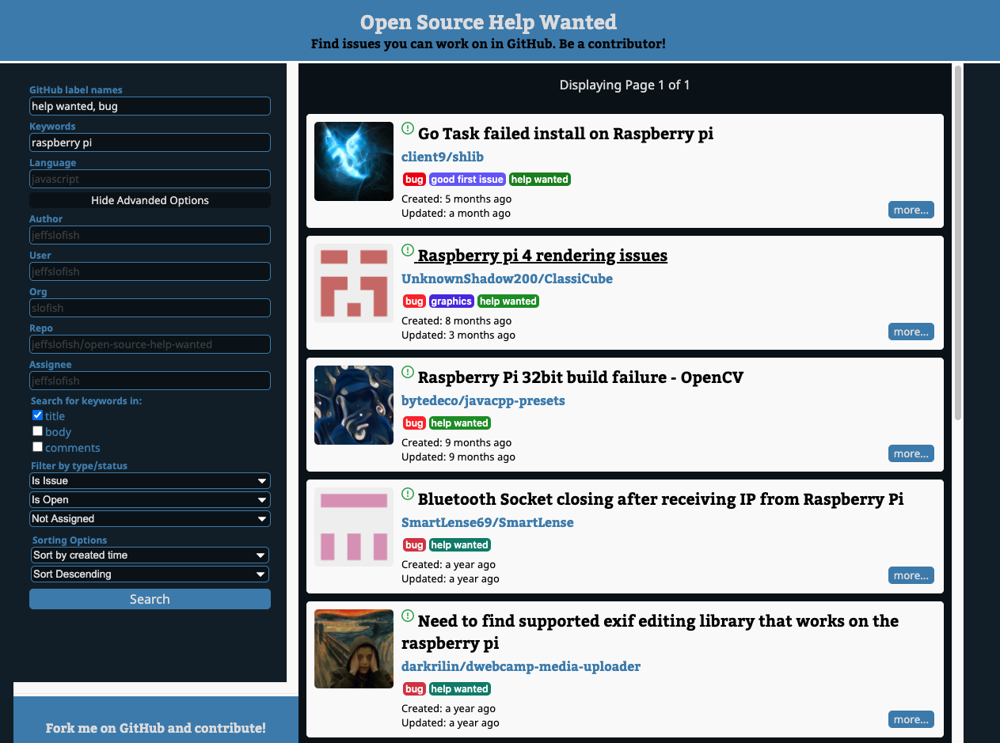

# Open Source Help Wanted

Find issues to work on with the labels and keywords you specify.

See live app running here: https://www.opensourcehelpwanted.com/.

## To get started

1. Clone this repo
1. From the cloned directory, run `npm install && cd client && npm install && cd ..`
1. Run `npm start` to start the front-end at http://localhost:3000 (and back-end at http://localhost:5000) and automatically reload when you change a project file

## Optional steps to be able to make more frequent calls to the GitHub API

1. Get a personal access token from GitHub: https://github.com/settings/tokens
2. Make a copy of .env.sample and name it .env and paste your personal access token in the placeholder text
