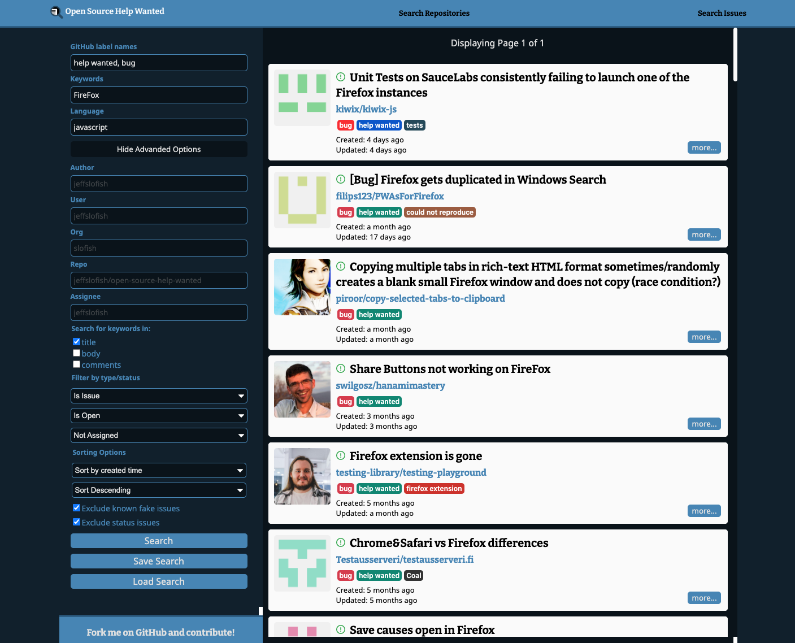
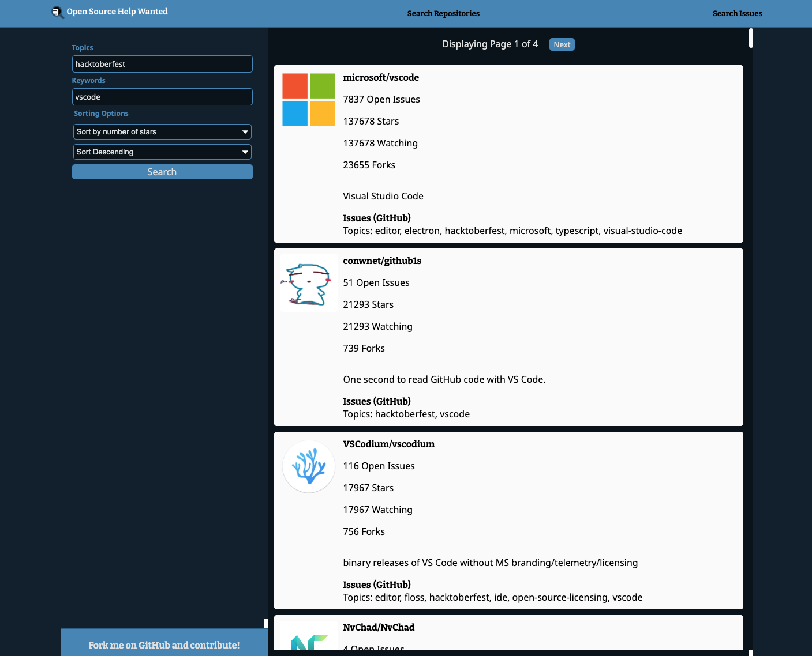

# Open Source Help Wanted

Find open source repositories and issues to work on.

See live app running here: https://www.opensourcehelpwanted.com/.

## To get started

1. Clone this repo
1. Copy .env.sample to .env
1. Create a GitHub OAuth App by going to Settings/Developer settings in GitHub and clicking "New OAuth App"
1. Enter any Application name, http://localhost:3000 for Homepage URL, and http://localhost:3000/oauth_redirect for Authorization callback URL
1. Click "Register Application"
1. Click "Generate a new client secret" and copy that value into .env where it says "your-client-secret-here"
1. Copy the Client ID and paste into .env where it says "your-app-client-id-here"
1. Run `npm install`
1. Run `npm start` to start the front-end at http://localhost:3000 (and back-end at http://localhost:9000) and automatically reload when you change a project file
